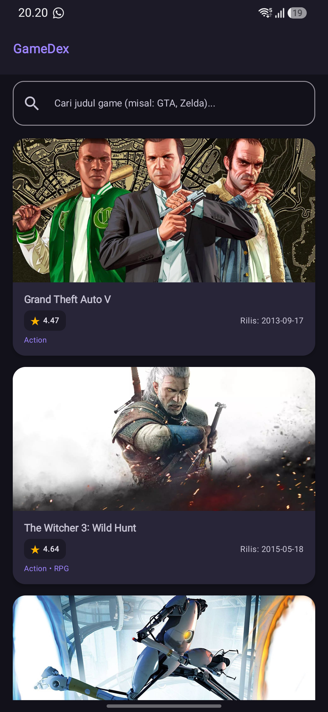
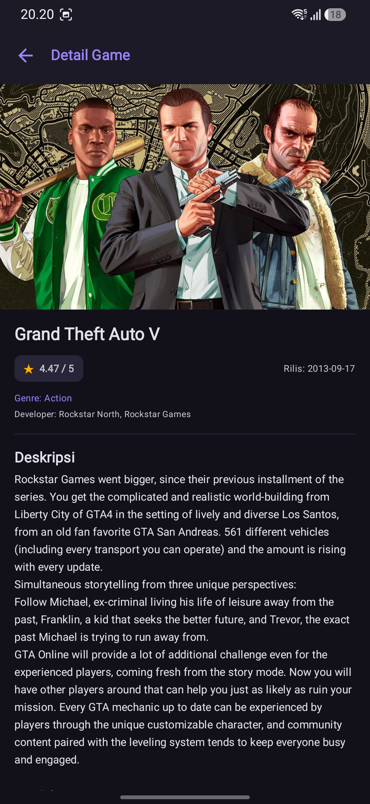
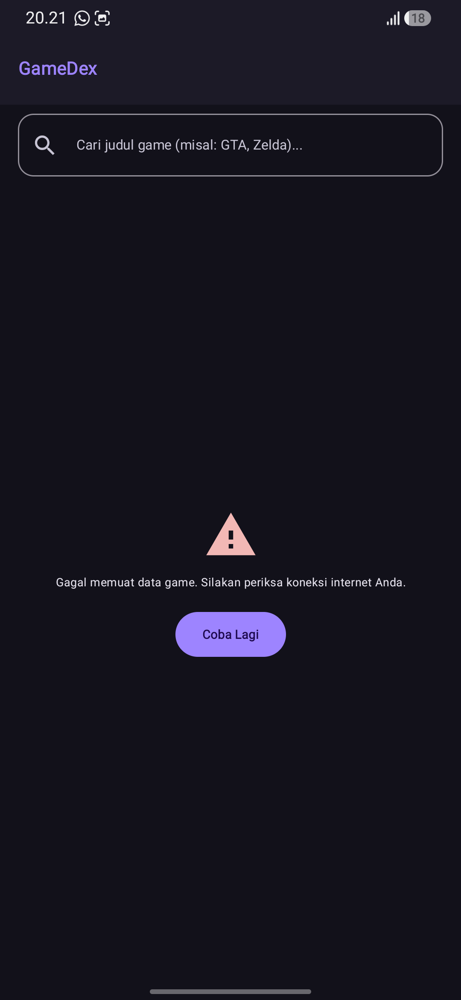

# GameDex - Katalog & Eksplorasi Video Game

Aplikasi Android untuk mencari dan melihat informasi video game secara online menggunakan data dari **RAWG Video Games Database API**. Proyek ini dibuat untuk memenuhi tugas **Responsi Praktikum Pemrograman Mobile**.

---

## Identitas Mahasiswa

- **Nama** : Zahratul Askia
- **NIM** : H1D024016
- **Shift KRS** : B
- **Shift Sekarang** : F
- **Program Studi** : Informatika
- **Fakultas** : Teknik
- **Universitas** : Universitas Jenderal Soedirman

---

## Screenshot Aplikasi

Berikut adalah tampilan antarmuka aplikasi GameDex yang dijalankan langsung pada perangkat Android:

| Halaman Utama (Katalog) | Pencarian Game |
| :---: | :---: |
|  |  |

| Halaman Detail Game | Penanganan Error (Offline) |
| :---: | :---: |
|  |  |

---

## Fitur Utama

1. **Katalog Game Online**: Menampilkan daftar game populer dari API RAWG secara dinamis menggunakan `LazyColumn`.
2. **Pencarian Real-Time (Debounce 500 ms)**: Pengguna bisa langsung mencari judul game di search bar. Dilengkapi jeda debounce 500 ms agar request API tidak terpanggil berulang kali di setiap ketikan keyboard.
3. **Detail Informasi Game**: Menampilkan gambar cover resolusi tinggi, rating (bintang), tanggal rilis, genre, developer, dan deskripsi lengkap game yang sudah dibersihkan dari format tag HTML.
4. **Navigasi Antar Halaman**: Berpindah halaman dari beranda ke detail game menggunakan `Navigation Compose` dengan mengirim argumen `gameId`.
5. **Penanganan 3 Status UI**:
   - **Loading**: Menampilkan `CircularProgressIndicator` saat data sedang diunduh.
   - **Success**: Menampilkan daftar/detail game, atau pesan *"Game tidak ditemukan"* jika hasil pencarian kosong.
   - **Error**: Menampilkan pesan error yang jelas dalam Bahasa Indonesia beserta tombol *"Coba Lagi"* jika koneksi terputus.
6. **Tema Gaming (Material 3)**: Desain visual bernuansa gaming (*dark purple & teal*) yang mendukung mode gelap (*Dark Mode*) maupun mode terang (*Light Mode*).
7. **Null Safety**: Semua model data dibuat nullable dan ditangani dengan aman (`?.` dan `?:`) tanpa operator `!!`, sehingga aplikasi tidak crash meskipun data dari server ada yang kosong.

---

## Teknologi & Library

- **Bahasa**: Kotlin `2.2.10`
- **Build System**: Android Gradle Plugin (AGP) `9.3.3`
- **Min SDK**: `29` (Android 10) | **Target SDK**: `37`
- **UI Framework**: Jetpack Compose (BOM `2026.02.01`) + Material Design 3
- **Networking**: Retrofit `2.11.0` & Gson Converter `2.11.0`
- **Image Loader**: Coil Compose `2.7.0`
- **Navigasi**: Navigation Compose `2.8.4`
- **Lifecycle & State**: Lifecycle ViewModel Compose `2.8.7` & Kotlin Coroutines

---

## Arsitektur Aplikasi (MVVM)

Aplikasi ini menerapkan pola **Model-View-ViewModel (MVVM)** sesuai materi praktikum:

```
[RAWG API Server]
       │ (Request HTTP / Respon JSON)
       ▼
[Retrofit & ApiService] (ApiClient dengan OkHttp Interceptor API Key)
       │ (Kotlin Coroutines / suspend function)
       ▼
[GameRepository] (Data Layer / Single Source of Truth)
       │ (List<GameItem> / GameDetailResponse)
       ▼
[GameViewModel] (StateFlow & Coroutine viewModelScope)
       │ (GameUiState & GameDetailUiState: Loading, Success, Error)
       ▼
[Jetpack Compose UI] (HomeScreen & GameDetailScreen)
```

- **Model**: Wadah data untuk menampung respon JSON dari server (`GameResponse`, `GameItem`, `GameDetailResponse`).
- **Data Layer (Network & Repository)**: Bertanggung jawab memanggil endpoint RAWG API dan mengolah data mentah.
- **ViewModel**: Mengatur logika bisnis, memproses query pencarian, dan mengekspos status UI lewat `StateFlow`.
- **View (UI)**: Komponen composable yang hanya bertugas menampilkan data dan mengirim interaksi pengguna ke ViewModel.

---

## Penjelasan Potongan Kode

### 1. Data Class & Null Safety
Semua data class memakai anotasi `@SerializedName` dari Gson. Properti dibuat nullable (`?`) dengan nilai default `null` agar aplikasi tetap aman jika server mengembalikan data yang tidak lengkap:
```kotlin
data class GameItem(
    @SerializedName("id") val id: Int? = null,
    @SerializedName("name") val name: String? = null,
    @SerializedName("released") val released: String? = null,
    @SerializedName("background_image") val backgroundImage: String? = null,
    @SerializedName("rating") val rating: Double? = null,
    @SerializedName("genres") val genres: List<Genre>? = null
)
```

### 2. Retrofit & OkHttp Interceptor (API Key Otomatis)
Inisialisasi Retrofit dibuat secara singleton memakai `by lazy` pada `ApiClient.kt`. Interceptor digunakan untuk menyisipkan parameter `key` dari `BuildConfig.RAWG_API_KEY` ke setiap request secara otomatis:
```kotlin
private val okHttpClient: OkHttpClient by lazy {
    OkHttpClient.Builder()
        .addInterceptor { chain ->
            val originalRequest = chain.request()
            val originalUrl = originalRequest.url
            val urlWithApiKey = originalUrl.newBuilder()
                .addQueryParameter("key", BuildConfig.RAWG_API_KEY)
                .build()
            val newRequest = originalRequest.newBuilder().url(urlWithApiKey).build()
            chain.proceed(newRequest)
        }
        .build()
}
```

### 3. Repository Pattern
`GameRepository.kt` menghubungkan `ApiService` dengan ViewModel. Jika teks pencarian kosong atau spasi, dikirim sebagai `null` agar Retrofit tidak menambahkan query pencarian kosong:
```kotlin
suspend fun getGames(search: String? = null, pageSize: Int? = 20): List<GameItem> {
    val queryParam = if (search.isNullOrBlank()) null else search.trim()
    val response = apiService.getGames(search = queryParam, pageSize = pageSize)
    return response.results ?: emptyList()
}
```

### 4. ViewModel, Debounce, & CancellationException
Di `GameViewModel.kt`, state internal disimpan di `MutableStateFlow` privat dan diekspos sebagai `StateFlow` read-only. Fitur pencarian diberi jeda debounce 500 ms, dan `CancellationException` dilempar kembali agar pembatalan ketikan tidak dianggap sebagai error koneksi:
```kotlin
fun onQueryChange(newQuery: String) {
    _searchQuery.value = newQuery
    searchJob?.cancel() // Batalkan coroutine sebelumnya jika masih mengetik
    searchJob = viewModelScope.launch {
        delay(500L)
        fetchGames(query = newQuery)
    }
}

// Di blok catch fungsi fetchGames:
} catch (e: kotlinx.coroutines.CancellationException) {
    throw e // Jangan jadikan error jika dibatalkan saat pengguna mengetik
} catch (e: Exception) {
    _uiState.value = GameUiState.Error("Gagal memuat data game. Silakan periksa koneksi internet Anda.")
}
```

### 5. Pengelolaan State pada UI (State Hoisting)
UI membaca data menggunakan `collectAsState()` lalu merender tampilan lewat percabangan `when (uiState)`:
```kotlin
val uiState by viewModel.uiState.collectAsState()
when (uiState) {
    is GameUiState.Loading -> CircularProgressIndicator()
    is GameUiState.Error -> ErrorContent(message = uiState.message, onRetry = onRetry)
    is GameUiState.Success -> LazyColumn(...)
}
```

### 6. LazyColumn dengan Key
Di `HomeScreen.kt`, `LazyColumn` diberi identitas unik lewat `key` dari ID game agar recomposition berjalan lebih ringan dan efisien:
```kotlin
LazyColumn(
    modifier = Modifier.fillMaxSize(),
    verticalArrangement = Arrangement.spacedBy(14.dp)
) {
    items(
        items = uiState.games,
        key = { item -> item.id ?: item.hashCode() }
    ) { game ->
        GameCard(game = game, onClick = { onGameClick(game.id ?: 0) })
    }
}
```

### 7. Navigasi & Shared ViewModel di MainActivity
Navigasi diatur di `MainActivity.kt` menggunakan `NavHost`. Satu instance `GameViewModel` dibuat di level Activity dan dioper ke HomeScreen dan GameDetailScreen agar data pencarian tidak hilang saat kembali dari detail:
```kotlin
val sharedViewModel: GameViewModel = viewModel()
NavHost(navController = navController, startDestination = "home") {
    composable(route = "home") {
        HomeScreen(
            viewModel = sharedViewModel,
            onGameClick = { gameId -> navController.navigate("detail/$gameId") }
        )
    }
    composable(
        route = "detail/{gameId}",
        arguments = listOf(navArgument("gameId") { type = NavType.IntType })
    ) { backStackEntry: NavBackStackEntry ->
        val gameId = backStackEntry.arguments?.getInt("gameId") ?: 0
        GameDetailScreen(
            gameId = gameId,
            viewModel = sharedViewModel,
            onBackClick = { navController.popBackStack() }
        )
    }
}
```

### 8. Pembersihan Tag HTML Deskripsi
Di `GameDetailScreen.kt`, jika deskripsi game dari API masih berformat tag HTML (`<p>`, `<a>`), tag tersebut dibersihkan dengan `HtmlCompat.fromHtml()`:
```kotlin
val finalDescription = when {
    !game.descriptionRaw.isNullOrBlank() -> game.descriptionRaw.trim()
    !game.description.isNullOrBlank() -> HtmlCompat.fromHtml(
        game.description,
        HtmlCompat.FROM_HTML_MODE_COMPACT
    ).toString().trim()
    else -> "Deskripsi tidak tersedia"
}
```

---

## Struktur Folder Project

```
app/src/main/java/com/example/responsizahratul/
├── MainActivity.kt                  # NavHost dan shared ViewModel
├── data/
│   ├── model/
│   │   ├── GameResponse.kt          # Model daftar game, GameItem, Genre
│   │   └── GameDetailResponse.kt    # Model detail game, Developer, Publisher
│   ├── network/
│   │   ├── ApiService.kt            # Interface Retrofit (GET /games, GET /games/{id})
│   │   └── ApiClient.kt             # Inisialisasi Retrofit & Interceptor API Key
│   └── repository/
│       └── GameRepository.kt        # Repository perantara ApiService ke ViewModel
└── ui/
    ├── components/
    │   └── GameCard.kt              # Kartu game pada LazyColumn
    ├── screen/
    │   ├── HomeScreen.kt            # Halaman utama & pencarian
    │   └── GameDetailScreen.kt      # Halaman detail game
    ├── theme/
    │   ├── Color.kt                 # Warna tema gaming (Dark & Light)
    │   ├── Theme.kt                 # ResponsizahratulTheme Material 3
    │   └── Type.kt                  # Pengaturan typography
    └── viewmodel/
        ├── GameUiState.kt           # Sealed interface state (Loading, Success, Error)
        └── GameViewModel.kt         # StateFlow, debounce pencarian, coroutines
```

---

## Cara Menjalankan Project

1. **Clone repository**:
   ```bash
   git clone https://github.com/radenjayden90/H1D024016-ZahratulAskia-Responsi-UTS-PrakPemmob.git
   cd responsizahratul
   ```

2. **Dapatkan API Key RAWG**:
   - Buka [https://rawg.io/apidocs](https://rawg.io/apidocs) dan buat akun gratis.
   - Dapatkan kunci API Anda.

3. **Buat file `local.properties`**:
   Buka file `local.properties` di root folder project, lalu tambahkan baris berikut:
   ```properties
   RAWG_API_KEY=MASUKKAN_API_KEY_RAWG_DISINI
   ```
   *(File `local.properties` sudah masuk ke `.gitignore` sehingga aman dan tidak akan ter-push ke GitHub).*

4. **Buka di Android Studio**:
   - Buka project di Android Studio.
   - Tunggu proses Gradle Sync selesai.
   - Sambungkan HP fisik (USB Debugging) atau jalankan Emulator Android (API Level 29+).
   - Klik tombol **Run** (segitiga hijau) atau build via terminal:
     ```bash
     ./gradlew assembleDebug
     ```
