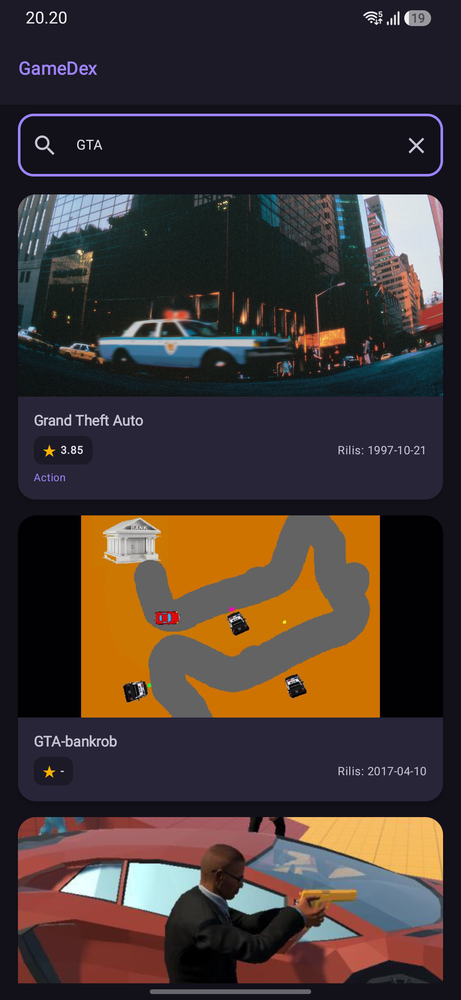

# GameDex - Aplikasi Katalog & Eksplorasi Video Game

Aplikasi mobile Android berbasis **Jetpack Compose** untuk mencari, melihat katalog, dan mengeksplorasi informasi detail video game secara dinamis menggunakan RESTful API dari **RAWG Video Games Database**. Proyek ini disusun untuk memenuhi tugas **Responsi Praktikum Pemrograman Mobile**.

---

## Identitas Pengembang
- **Nama** : Zahratul Askia
- **NIM** : H1D024016
- **Program Studi** : Informatika
- **Fakultas** : Teknik
- **Universitas** : Universitas Jenderal Soedirman

---

## Tangkapan Layar (Screenshots)

Berikut adalah tampilan antarmuka aplikasi GameDex:

| Halaman Utama (Home) | Pencarian Game (Search) |
| :---: | :---: |
|  |  |

| Detail Game (Detail) | Penanganan Error (Error State) |
| :---: | :---: |
|  |  |

> *Catatan: Letakkan tangkapan layar perangkat Anda pada folder `screenshots/` dengan nama file `home.png`, `search.png`, `detail.png`, dan `error.png`.*

---

## Fitur Aplikasi

1. **Katalog Game Dinamis**: Menampilkan daftar game populer dari RAWG API secara asinkron menggunakan komponen `LazyColumn`.
2. **Pencarian Real-Time dengan Debounce (500 ms)**: Pengguna dapat mencari judul game melalui kolom pencarian. Pencarian dilengkapi penundaan (*debounce*) selama 500 ms guna mencegah pemanggilan API berlebihan di setiap ketikan huruf.
3. **Detail Informasi Game**: Menampilkan gambar resolusi tinggi, judul, rating (skala 5), tanggal rilis (format ISO 8601 `YYYY-MM-DD`), daftar genre, pengembang (developer), serta deskripsi lengkap game yang bersih dari format HTML.
4. **Navigasi Multi-Halaman**: Perpindahan halaman mulus antara Beranda dan Halaman Detail menggunakan **Navigation Compose** dengan pengiriman argumen `gameId` bertipe `Int`.
5. **Penanganan 3 Status UI (State-Driven UI)**: Setiap layar secara reaktif menangani kondisi:
   - **Loading**: Animasi `CircularProgressIndicator` saat memuat data.
   - **Success**: Menampilkan data atau teks `"Game tidak ditemukan"` jika hasil pencarian kosong.
   - **Error**: Pesan kegagalan koneksi ramah pengguna dalam Bahasa Indonesia lengkap dengan tombol **"Coba Lagi"** (*Retry*).
6. **Tema Gaming Modern (Material Design 3)**: Skema warna bertema game (*deep purple & neon teal*) dengan dukungan penuh **Mode Gelap (Dark Mode)** dan **Mode Terang (Light Mode)**.
7. **Keamanan Null (Null-Safety)**: Seluruh parsing data dan pemrosesan logika bebas dari operator pemaksaan `!!`. Data kosong atau null ditangani secara elegan dengan nilai fallback (misal: `"-"` atau `"Belum ada rating"`).

---

## Teknologi & Dependensi

Proyek dikembangkan menggunakan spesifikasi berikut (sesuai konfigurasi `libs.versions.toml` dan `build.gradle.kts`):

- **Bahasa Pemrograman**: Kotlin `2.2.10`
- **Android Gradle Plugin (AGP)**: `9.3.3`
- **Minimum SDK**: `29` (Android 10)
- **Target SDK & Compile SDK**: `37`
- **Jetpack Compose BOM**: `2026.02.01`
- **Material Design 3**: `androidx.compose.material3`
- **Networking (Retrofit & Converter)**: `com.squareup.retrofit2:retrofit:2.11.0` & `converter-gson:2.11.0`
- **Image Loading**: `io.coil-kt:coil-compose:2.7.0`
- **Navigation**: `androidx.navigation:navigation-compose:2.8.4`
- **ViewModel Compose**: `androidx.lifecycle:lifecycle-viewmodel-compose:2.8.7`
- **Material Icons**: `androidx.compose.material:material-icons-core`

---

## Arsitektur Aplikasi (MVVM)

Aplikasi menerapkan pola arsitektur **Model-View-ViewModel (MVVM)** sesuai dengan materi perkuliahan Mobile Programming:

```
[RAWG REST API] 
       │ (HTTP Request / JSON Response)
       ▼
[Retrofit & ApiService] (ApiClient with OkHttp Interceptor)
       │ (Kotlin Coroutines / suspend fun)
       ▼
[GameRepository] (Single Source of Truth / Data Layer)
       │ (Result / List<GameItem> / GameDetailResponse)
       ▼
[GameViewModel] (StateFlow & Coroutine viewModelScope)
       │ (Reaktif State: GameUiState & GameDetailUiState)
       ▼
[Jetpack Compose UI] (HomeScreen & GameDetailScreen)
```

- **Model**: Merepresentasikan struktur data API RAWG (`GameResponse`, `GameItem`, `GameDetailResponse`).
- **Data Layer (Network & Repository)**: Bertanggung jawab melakukan komunikasi HTTP ke server RAWG dan menyediakan data bersih bagi aplikasi.
- **ViewModel**: Mengelola logika bisnis, menyimpan state pencarian, mengeksekusi coroutine di latar belakang (*background thread*), serta mengekspos UI State secara reaktif.
- **View (UI)**: Komponen deklaratif Jetpack Compose yang mengamati (*collect*) state dari ViewModel dan merender antarmuka tanpa memproses logika data langsung.

---

## Penjelasan Teknis Kode Proyek

### 1. Data Class & Null-Safety
Seluruh model data didefinisikan menggunakan `data class` dengan anotasi `@SerializedName` dari pustaka Gson. Untuk menghindari crash akibat data yang tidak lengkap dari server, semua properti dibuat *nullable* (`?`) dengan nilai default `null`:
```kotlin
data class GameItem(
    @SerializedName("id") val id: Int? = null,
    @SerializedName("name") val name: String? = null,
    @SerializedName("released") val released: String? = null,
    @SerializedName("background_image") val backgroundImage: String? = null,
    @SerializedName("rating") val rating: Double? = null,
    @SerializedName("genres") val genres: List<Genre>? = null
)
```

### 2. Retrofit & Otomatisasi API Key via OkHttp Interceptor
Instance Retrofit dibuat secara *singleton* menggunakan delegasi inisialisasi malas `by lazy` di [ApiClient.kt](app/src/main/java/com/example/responsizahratul/data/network/ApiClient.kt). Agar API Key tidak ditulis berulang pada setiap endpoint, digunakan `OkHttpClient.Builder().addInterceptor`:
```kotlin
private val okHttpClient: OkHttpClient by lazy {
    OkHttpClient.Builder()
        .addInterceptor { chain ->
            val originalRequest = chain.request()
            val originalUrl = originalRequest.url
            val urlWithApiKey = originalUrl.newBuilder()
                .addQueryParameter("key", BuildConfig.RAWG_API_KEY)
                .build()
            val newRequest = originalRequest.newBuilder().url(urlWithApiKey).build()
            chain.proceed(newRequest)
        }
        .build()
}
```

### 3. Repository Pattern
[GameRepository.kt](app/src/main/java/com/example/responsizahratul/data/repository/GameRepository.kt) bertindak sebagai jembatan antara jaringan dan ViewModel. Repository menyaring parameter pencarian agar mengirim `null` jika teks pencarian kosong atau spasi, serta membiarkan exception dilempar ke ViewModel agar status error dapat ditangani secara akurat:
```kotlin
suspend fun getGames(search: String? = null, pageSize: Int? = 20): List<GameItem> {
    val queryParam = if (search.isNullOrBlank()) null else search.trim()
    val response = apiService.getGames(search = queryParam, pageSize = pageSize)
    return response.results ?: emptyList()
}
```

### 4. ViewModel, StateFlow, Debounce, & Rethrow CancellationException
Pada [GameViewModel.kt](app/src/main/java/com/example/responsizahratul/ui/viewmodel/GameViewModel.kt):
- Menerapkan *State Encapsulation* menggunakan `MutableStateFlow` privat yang diekspos sebagai `StateFlow` *read-only*.
- Fitur *Debounce 500 ms*: Setiap ketikan karakter membatalkan tugas coroutine sebelumnya (`searchJob?.cancel()`) dan menunda permintaan API selama 500 ms guna menghindari spam request.
- Pengecualian pembatalan coroutine (`CancellationException`) dilempar kembali (*rethrow*) agar tidak tertangkap oleh blok `catch (e: Exception)` umum sebagai status `Error`:
```kotlin
fun onQueryChange(newQuery: String) {
    _searchQuery.value = newQuery
    searchJob?.cancel()
    searchJob = viewModelScope.launch {
        delay(500L)
        fetchGames(query = newQuery)
    }
}

// Di dalam fungsi fetch:
} catch (e: kotlinx.coroutines.CancellationException) {
    throw e // Jangan jadikan error jika coroutine dibatalkan saat pengguna mengetik
} catch (e: Exception) {
    _uiState.value = GameUiState.Error("Gagal memuat data game. Silakan periksa koneksi internet Anda.")
}
```

### 5. Pengelolaan State & Recomposition pada Jetpack Compose
Status antarmuka dimodelkan menggunakan *Sealed Interface* (`GameUiState` & `GameDetailUiState`). Di lapisan UI, Composable mengamati aliran data menggunakan `collectAsState()` dan merender tampilan secara dinamis melalui percabangan `when (uiState)`:
```kotlin
val uiState by viewModel.uiState.collectAsState()
when (uiState) {
    is GameUiState.Loading -> CircularProgressIndicator()
    is GameUiState.Error -> ErrorView(message = uiState.message, onRetry = onRetry)
    is GameUiState.Success -> LazyColumn(...)
}
```

### 6. LazyColumn dengan Identitas Unik (Key)
Komponen `LazyColumn` merender kumpulan kartu game secara efisien. Properti `key` diisi dengan ID game unik agar Compose dapat mengoptimalkan proses rekomposisi saat daftar data diperbarui:
```kotlin
LazyColumn(
    modifier = Modifier.fillMaxSize(),
    verticalArrangement = Arrangement.spacedBy(14.dp)
) {
    items(
        items = uiState.games,
        key = { item -> item.id ?: item.hashCode() }
    ) { game ->
        GameCard(game = game, onClick = { onGameClick(game.id ?: 0) })
    }
}
```

### 7. Navigasi Multi-Screen (Navigation Compose)
Navigasi diatur di [MainActivity.kt](app/src/main/java/com/example/responsizahratul/MainActivity.kt) menggunakan `NavHost` dengan satu instance `GameViewModel` bersama yang dibuat di level Activity:
```kotlin
val sharedViewModel: GameViewModel = viewModel()
NavHost(navController = navController, startDestination = "home") {
    composable("home") {
        HomeScreen(viewModel = sharedViewModel, onGameClick = { id -> navController.navigate("detail/$id") })
    }
    composable(
        route = "detail/{gameId}",
        arguments = listOf(navArgument("gameId") { type = NavType.IntType })
    ) { backStackEntry ->
        val gameId = backStackEntry.arguments?.getInt("gameId") ?: 0
        GameDetailScreen(gameId = gameId, viewModel = sharedViewModel, onBackClick = { navController.popBackStack() })
    }
}
```

### 8. Sanitasi HTML & Fallback Data Null
Pada halaman detail, deskripsi dibersihkan dari tag HTML menggunakan `HtmlCompat.fromHtml`, dan rating/tanggal yang null diberikan nilai cadangan:
```kotlin
val finalDescription = when {
    !game.descriptionRaw.isNullOrBlank() -> game.descriptionRaw.trim()
    !game.description.isNullOrBlank() -> HtmlCompat.fromHtml(
        game.description,
        HtmlCompat.FROM_HTML_MODE_COMPACT
    ).toString().trim()
    else -> "Deskripsi tidak tersedia"
}
```

---

## Struktur Direktori Proyek

```
app/src/main/java/com/example/responsizahratul/
├── MainActivity.kt                  # Entry point, konfigurasi NavHost & shared ViewModel
├── data/
│   ├── model/
│   │   ├── GameResponse.kt          # Data class respons daftar game & GameItem
│   │   └── GameDetailResponse.kt    # Data class detail game, Developer, Publisher
│   ├── network/
│   │   ├── ApiService.kt            # Interface Retrofit (GET /games, GET /games/{id})
│   │   └── ApiClient.kt             # Singleton Retrofit & Interceptor RAWG API Key
│   └── repository/
│       └── GameRepository.kt        # Abstraksi data layer untuk konsumsi ViewModel
└── ui/
    ├── components/
    │   └── GameCard.kt              # Kartu item game di daftar katalog
    ├── screen/
    │   ├── HomeScreen.kt            # Layar katalog utama & pencarian
    │   └── GameDetailScreen.kt      # Layar detail informasi lengkap game
    ├── theme/
    │   ├── Color.kt                 # Palet warna bernuansa gaming (Dark & Light)
    │   ├── Theme.kt                 # Material 3 Theme (ResponsizahratulTheme)
    │   └── Type.kt                  # Skala tipografi Material 3
    └── viewmodel/
        ├── GameUiState.kt           # Sealed interface UI State (Loading, Success, Error)
        └── GameViewModel.kt         # StateFlow, debounce pencarian, coroutines
```

---

## Panduan Menjalankan Proyek

1. **Clone Repository**:
   ```bash
   git clone <URL_REPOSITORY_ANDA>
   cd responsizahratul
   ```

2. **Dapatkan API Key RAWG**:
   - Daftarkan akun gratis di [https://rawg.io/apidocs](https://rawg.io/apidocs).
   - Salin kunci API (32 karakter alfanumerik) yang Anda peroleh.

3. **Konfigurasi `local.properties`**:
   Buka file `local.properties` pada root direktori project, lalu tambahkan baris berikut:
   ```properties
   RAWG_API_KEY=MASUKKAN_API_KEY_RAWG_ANDA_DI_SINI
   ```
   > **Keamanan Terjamin**: File `local.properties` telah terdaftar di `.gitignore` sehingga API key Anda tidak akan pernah terunggah ke repositori publik GitHub.

4. **Kompilasi & Jalankan**:
   - Buka project di **Android Studio** (Ladybug / Hedgehog / Jellyfish atau versi yang mendukung AGP 9.x).
   - Tunggu proses Gradle Sync selesai.
   - Sambungkan perangkat fisik (USB Debugging) atau gunakan Emulator Android (API Level 29+).
   - Klik tombol **Run 'app'** (ikon segitiga hijau) atau jalankan melalui terminal:
     ```bash
     ./gradlew assembleDebug
     ```
